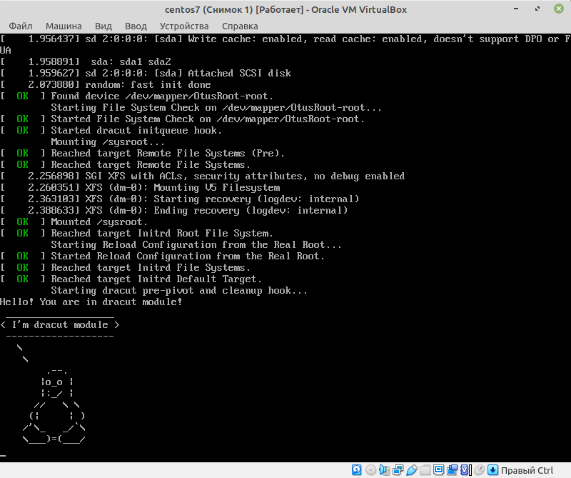

# Домашнее задание

## Работа с загрузчиком

1. Попасть в систему без пароля несколькими способами
2. Установить систему с LVM, после чего переименовать VG
3. Добавить модуль в initrd

### Дополнительное задание

4. (*) Сконфигурировать систему без отдельного раздела с
`/boot`, а только с LVM. [Репозиторий](https://yum.rumyantsev.com/centos/7/x86_64/) с пропатченым `grub/`.  PV необходимо инициализировать с параметром `--bootloaderareasize 1m`

## Критерии оценки: 
Описать действия, описать разницу между методами получения шелла в процессе загрузки.

Где получится - используем script, где не получается - словами или копипастой описываем действия.

## Сделано

1. Попал в систему несклькими способами (как описано в методичке). Что интересно, в ВМ развёрнутую через Vagrantfile - никак, в развёрнутую из ISO - без проблем. 
    - При выборе ядра для загрузки `e`, после чего в конец строки `ctrl+e` дописываем `init=/bin/sh` и для выполенния `ctrl+x`. После чего перемонитруем корневой раздел в RW режиме `mount -o remount,rw /`
    - При выборе ядра для загрузки `e`, после чего в конец строки `ctrl+e` дописываем `rd.break` и для выполенния `ctrl+x`. Попадаем в emergency mode. После чего перемонитруем первоначальный раздел в RW режиме `mount -o remount,rw /sysroot`, "чрутитмся" в реальный корневой раздел `chroot /sysroot`, меняем пароль `passwd root` и создаём файл для перерамарикровки контекстов для SELinux `touch /.autorelabel`
    - При выборе ядра для загрузки `e`, после чего заменяем `ro` на `rw init=/sysroot/bin/sh` и для выполенния `ctrl+x`.
2. [Лог](typescript-01) переименования VG согласно методичики и [после перезагрузки](typescript-02).
3. [Лог](typescript-03) добавления модуля ядра согласно методичики и пингвин

    
Tux

    

